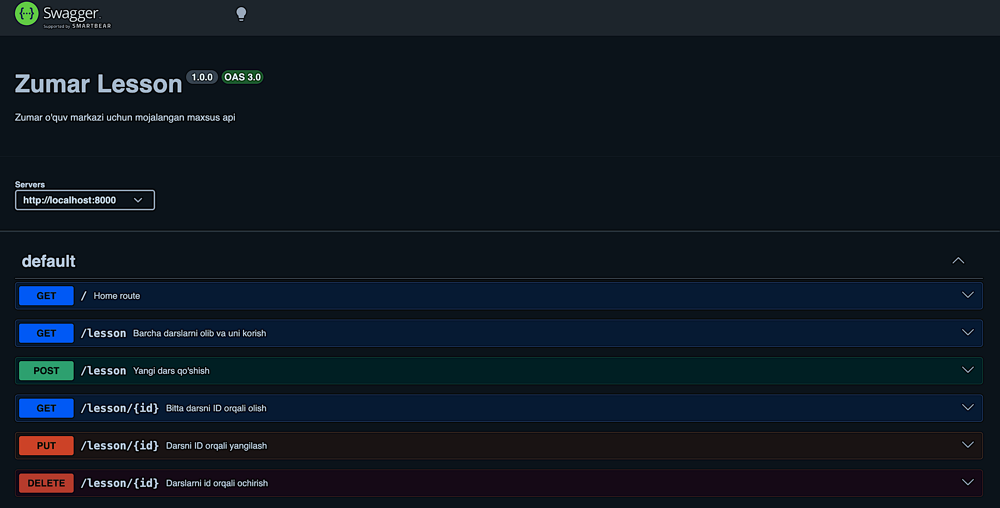

<p align="center">
  
</p>

High-performance, scalable RESTful API built with **Node.js** and **Clean Architecture** principles.

---

## System Architecture

The system follows a strict **Controller-Service-Repository** pattern to ensure separation of concerns and testability.

<p align="center">
  
</p>

---

## 🛠 Tech Stack

- **Runtime:** Node.js `v20.x`
- **Framework:** Express.js (Strict Routing)
- **Database:** MongoDB via Mongoose (Schema-based)
- **Security:** JWT (Stateless Auth), Argon2/Bcrypt, Helmet, Rate Limiter
- **Validation:** Zod (Type-safe validation)

---

## 📂 Project Blueprint

```text
src/
├── api/                # Application entry points
│   ├── controllers/    # Request handling & orchestration
│   ├── middlewares/    # Auth, Validation, Error Handling
│   └── routes/         # Semantic versioned endpoints
├── core/               # Business logic & Domain entities
│   ├── services/       # Core business rules
│   └── models/         # Data definitions
├── shared/             # Utilities, Configs, Constants
└── server.js           # Process management
